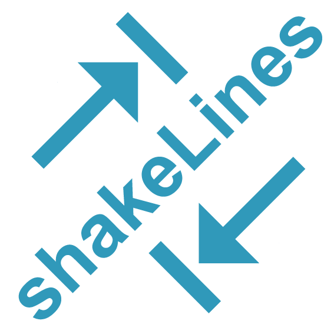

# shakeLines
shakeLines tries to optimize or recover your code by permuting its lines.

shakeLines is a TypeScript function. It takes three arguments:

    plainTextJavascript: string // Your code separated with \n newlines
    inputArguments: any         // Any arguments [arg1: any, arg2: any ...]
    expectedOutput: any         // Any output

Use example 1: optimize some code which works but can run faster.

    const useSampleOptimize = () => {
      return shakeLines(
        'x = Math.random();\ny = 0; \nx *= y; \na = 3; \nreturn (a * x); \nreturn 0;',
        ['n', 'm'],
        0
      )
    }

    useSampleOptimize()

Use example 2: this code doesn't work now but it will work when shaked well. 

    const useSampleRecovery = () => {
      return shakeLines(
        'return undefined;\nx = Math.random();\ny = 0; \nx *= y; \na = 3; \nreturn (a * x); \nreturn 0;',
        ['n', 'm'],
        0
      )
    }

    useSampleRecovery()

Use example 3: this code doesn't work and it won' work no matter what. 

    const useSampleNoSolution = () => {
      return shakeLines(
        'return undefined;\nx = 1;\ny=2;\nz=3;\n',
        ['z','q'],
        1
      )
    }

    useSampleOptimize()

